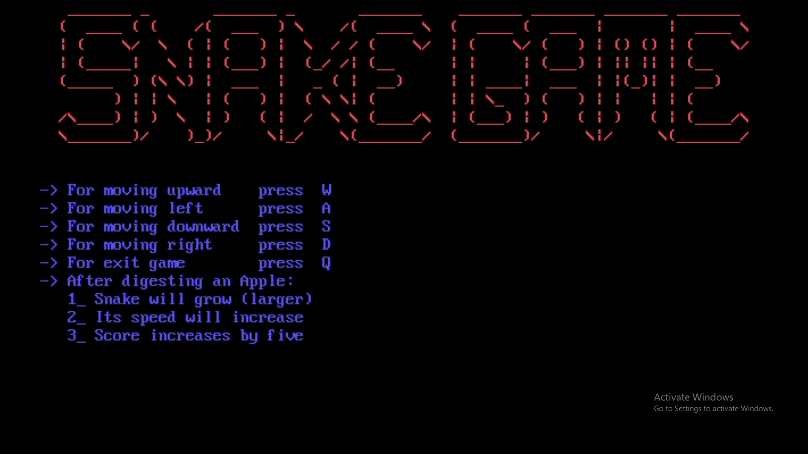
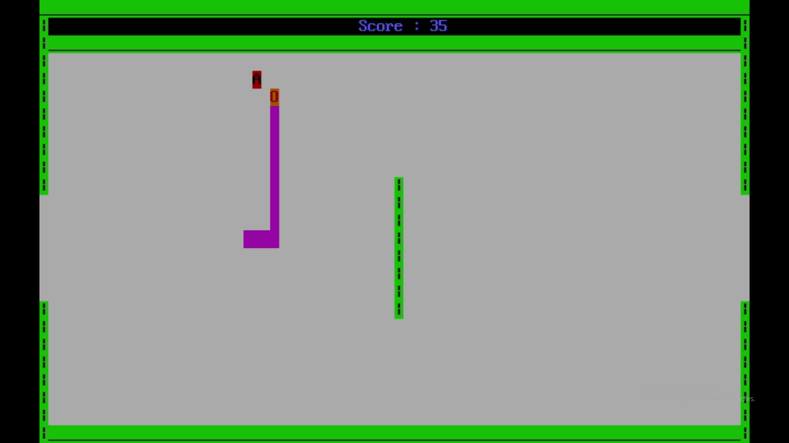
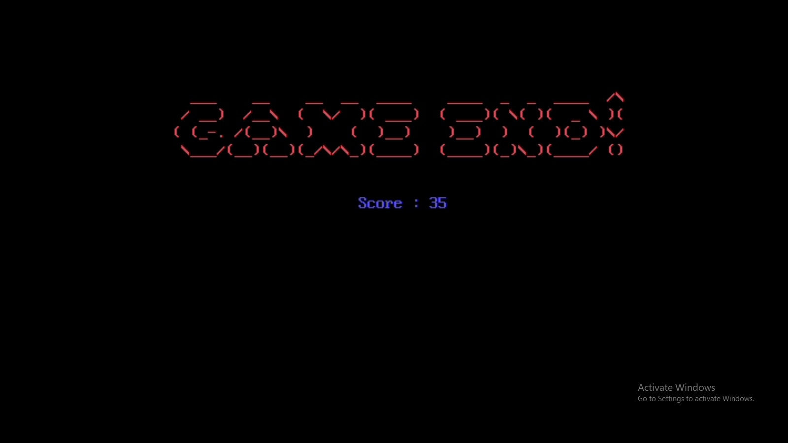

# Snake and Apple Game in Assembly Language

This project is a classic Snake and Apple game developed in Assembly Language. The game features a snake navigating through a field with boundaries, a central barrier, and teleportation holes on the left and right sides of the field.

## Table of Contents

- [Introduction](#introduction)
- [Game Description](#game-description)
- [Screenshots](#screenshots)
- [Installation](#installation)
- [Controls](#controls)
- [Game Features](#game-features)
- [Contributing](#contributing)
- [License](#license)

## Introduction

The Snake and Apple game is a simple yet engaging game where you control a snake to eat apples, avoid boundaries, and navigate through a field with obstacles. The game is developed using Assembly Language, making it a fascinating project for those interested in low-level programming.

## Game Description

- **Boundaries and Barriers**: The field has boundaries around it and a small barrier in the middle. The snake will die if it collides with the boundaries or the barrier.
- **Teleportation Holes**: There are holes in the left and right boundaries. If the snake enters the left hole, it will reappear through the right hole and vice versa.
- **Apple Eating**: When the snake eats an apple, its size and speed increase, and the game score increases by 5. A beep sound is played on eating an apple.
- **Game End**: The game ends if the snake collides with the boundary or barrier, and a beep sound is played.

## Screenshots
<div align="center">
  
  <p>*Game Start Screen*</p>
  
  <p>*Game Play Screen*</p>
  
  <p>*Game Over Screen*</p>
</div>

## Installation

To run this game, open the DosBox in the LogicWorks5 folder. Follow these steps to set up and run the game:

1. Clone the repository:
   ```bash
   git clone https://github.com/burhanahmed1/snake-and-apple-game.git
   ```
2. Navigate to the project directory:
   ```bash
   mount C D:\COAL
   ```
3. Assemble the game code:
   ```bash
   nasm SnakeAppleGame.asm -o SnakeAppleGame.com
   nasm SnakeAppleGame.asm -l SnakeAppleGame.lst
   ```
4. Run the game using an emulator:
   ```bash
   nasm SnakeAppleGame.com
   ```

## Controls
+ W: Move Upward
+ S: Move Downward
+ A: Move Leftward
+ D: Move Rightward
+ Q: Exit Game

## Game Features
+ **Boundaries and Barrier:** Navigate through the field avoiding collisions.
+ **Teleportation Holes:** Enter left hole to reappear on the right and vice versa.
+ **Apple Eating:** Increase size and speed, with score increment and beep sound.
+ **Game End:** Beep sound on game over.

## Contributing
Contributions are welcome! If you would like to contribute to this project, you can fork the repository and create a pull request with your improvements. Here's how you can do it:

1. Fork the repository.
2. Create a new branch for your feature or bugfix.
3. Make your changes and commit them.
4. Push your changes to your forked repository.
5. Create a pull request from your branch to the main repository.

## License
This project is licensed under the MIT License.
